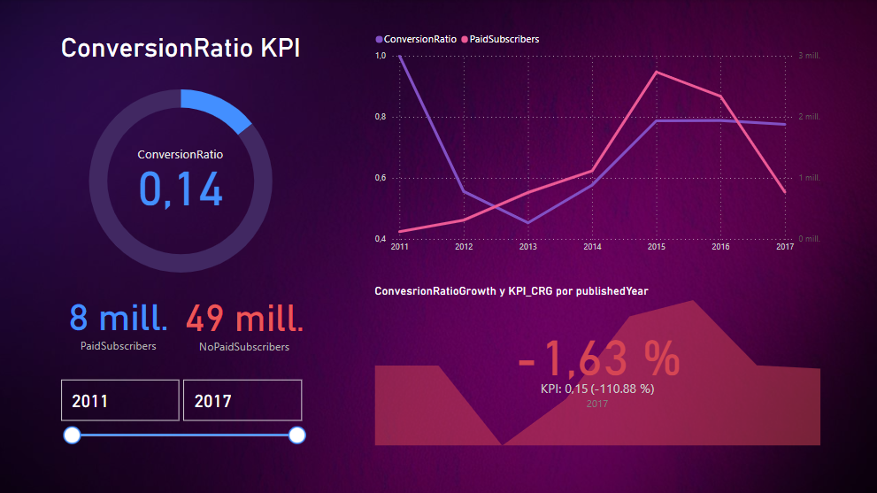
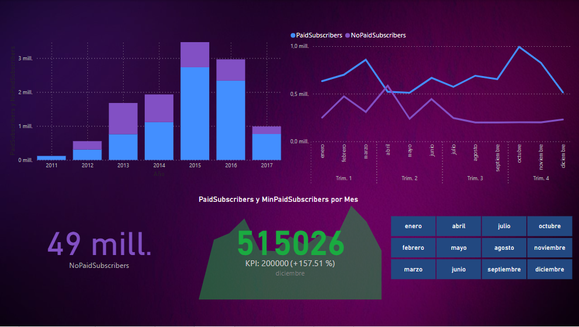

# Data Analytics Project - MOOCs Analysis

## Project Description

Welcome to my professional and engaging data analytics project! In this project, I take on the role of a Data Analyst working for a technology startup interested in entering the online courses market. As part of my responsibilities, I have acquired datasets from potential competitors to perform a comprehensive analysis and derive valuable insights from the collected data.

## Context and Problem Statement

Since the early 2010s, Massive Open Online Courses (MOOCs) have revolutionized the education industry. Platforms such as Udacity, edX, and Coursera have provided access to high-quality, practical, and convenient online learning experiences. With the increase in popularity of MOOCs, the market has become highly competitive, with private platforms, universities, and non-profit organizations offering a wide range of courses. Making it crucial for each platform to optimize their business models, courses, and content to attract and retain customers effectively.

My objective is to segment sales levels based on factors such as price, language, level, and course ratings. By analysing the influence of these variables on the product demand, I aim to provide actionable recommendations to the company.

Furthermore, I will create a visually appealing Word Cloud that highlights the most frequently repeated keywords in course titles, providing additional insights into the market trends.

To monitor the company's performance, I will focus on one key performance indicator (KPI) initially and propose three additional KPIs based on my analysis. The primary KPI is the conversion rate of free enrolments to paid enrolments, aiming to increase it by 15% compared to the previous year. I will also explore the possibility of obtaining complementary datasets from other platforms to evaluate this KPI across different MOOCs providers.

## Approach and Deliverables

### Exploratory Data Analysis (EDA)

I will conduct a thorough exploratory analysis of the datasets, documenting each step clearly in a Jupyter Notebook. The notebook will contain detailed insights and conclusions derived from various visualizations and analyses. I will strive for an organized and visually appealing notebook, ensuring the information is presented effectively.

### Interactive Dashboard

To facilitate data exploration and storytelling, I will develop an interactive dashboard. The dashboard will provide filtering capabilities, allowing users to delve into the data at a granular level. It will be designed with a focus on clarity and aesthetics, ensuring easy interpretation of information and utilizing suitable visualizations for the variables of interest.

### Analysis and Conclusions

This project goes beyond the creation of visualizations and dashboards; it aims to extract meaningful insights and draw valuable conclusions from the data. I will provide in-depth analyses, comparisons, and contextualization of the findings, ensuring the audience gains a comprehensive understanding of the market landscape.

### Key Performance Indicators (KPIs)

I will propose three additional KPIs that align with the project's narrative. These KPIs will be integrated into the dashboard, allowing stakeholders to monitor the company's performance effectively. Each KPI will be thoroughly explained, emphasizing its relevance and functionality.

## Repository Structure

- **Notebooks**: This folder contains Jupyter Notebooks documenting the exploratory analysis and dashboard creation.
- **Data**: All relevant datasets, including the ones provided and additional datasets, will be stored here.
- **Visualizations**: This folder holds visualizations generated during the exploratory analysis and for the dashboard.
- **Resources**: Additional resources, such as images or configuration files, can be found here.
- **Presentation**: Here, you will find the video demonstration of the dashboard and a comprehensive analysis report, including the suggested KPIs.
- **Data Engineer**: This folder focuses on data engineering tasks, such as data ingestion, cleaning, and transformation scripts.

## Feedback and Evaluation

I welcome feedback and constructive criticism. It is crucial for me to grow as a professional and improve my skills. I am committed to receiving feedback
